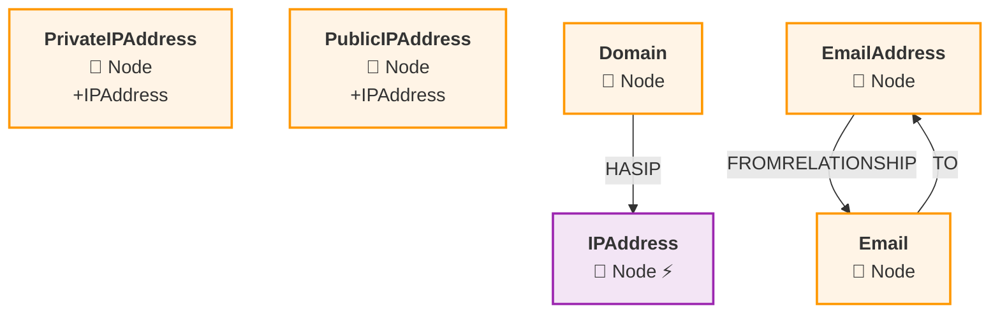

```mermaid
graph TB

%% Styling
classDef baseSchema fill:#e1f5ff,stroke:#0066cc,stroke-width:2px
classDef node fill:#fff4e6,stroke:#ff9800,stroke-width:2px
classDef classifiable fill:#f3e5f5,stroke:#9c27b0,stroke-width:2px

%% Nodes
IPAddress["<b>IPAddress</b><br/>🔷 Node ⚡"]:::classifiable
PrivateIPAddress["<b>PrivateIPAddress</b><br/>🔷 Node<br/>+IPAddress"]:::node
PublicIPAddress["<b>PublicIPAddress</b><br/>🔷 Node<br/>+IPAddress"]:::node
Domain["<b>Domain</b><br/>🔷 Node"]:::node
EmailAddress["<b>EmailAddress</b><br/>🔷 Node"]:::node
Email["<b>Email</b><br/>🔷 Node"]:::node

%% Relationships
Domain -->|HASIP| IPAddress
EmailAddress -->|FROMRELATIONSHIP| Email
Email -->|TO| EmailAddress

```